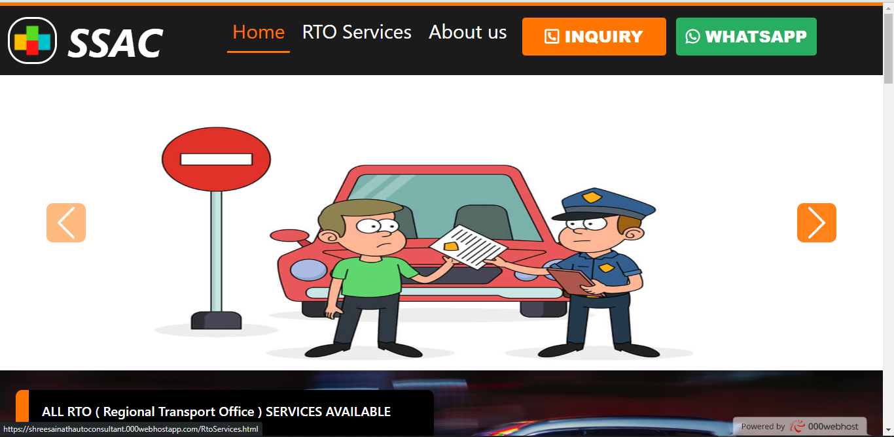
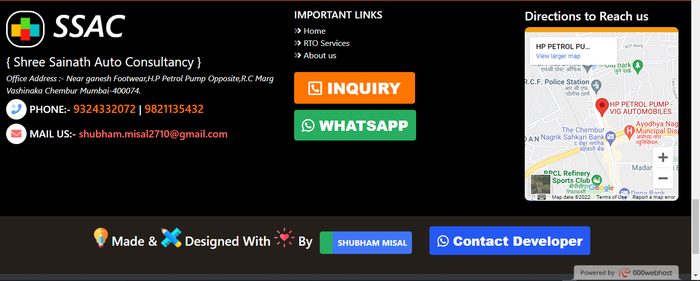
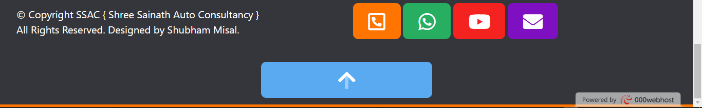

  

<h1 align="center">
  WEB-DEVELOPMENT
  </h1>
<h1>
My internship project, the website provides RTO services.
</h1>
<h2>
  Visit:-
<a href="https://shreesainathautoconsultant.000webhostapp.com" target="_blank" >https://shreesainathautoconsultant.000webhostapp.com</a>
</h2>

<h1>USER-INTERFACE</h1>

<h2>You can Download the code 👆 from the ZIP FILE uploaded (Rto Project.zip)</h2>
